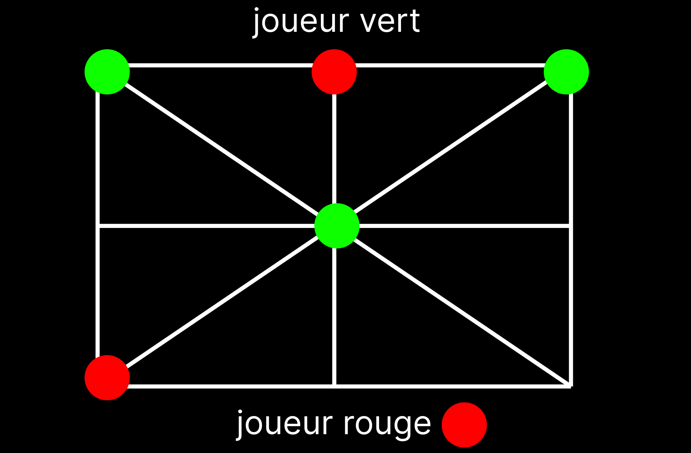

# Mefon - Une Variante de Nine Men's Morris / Jeu de Moulin

**Mefon** est une adaptation informatique d'un jeu traditionnel joué dans certaines localités du Cameroun. Ce jeu, proche de *Nine Men's Morris*, se distingue par des règles simples mais stratégiques, ce qui en fait une activité appréciée par les enfants et les adultes. 

## Screenshots  
  


## 📖 Description

Dans Mefon, deux joueurs s'affrontent sur une grille de 3x3 cases en utilisant trois pions chacun. L'objectif est d'aligner vos trois pions horizontalement, verticalement ou en diagonale, tout en empêchant votre adversaire de faire de même. Ce jeu se déroule en deux phases :  
1. **Positionnement des pions** : Chaque joueur place ses trois pions sur la grille.  
2. **Déplacement des pions** : Une fois tous les pions placés, les joueurs les déplacent pour tenter d'aligner leurs trois pions.  

## 🎮 Règles du jeu

### Phases de jeu
1. **Phase de positionnement** :  
   - Chaque joueur place, à tour de rôle, un pion sur une case vide de la grille.
   - Le premier joueur à aligner trois pions gagne la partie.

2. **Phase de déplacement** :  
   - Une fois tous les pions placés, les joueurs déplacent un pion à la fois sur une case adjacente vide.
   - Les déplacements doivent respecter les limites de la grille (pas de mouvements  hors-grille).
   - Si un joueur parvient à aligner trois pions avant son adversaire, il remporte la partie.

### Conditions de victoire
- Aligner trois pions horizontalement, verticalement ou en diagonale.  
- Empêcher l'adversaire d'aligner ses trois pions.

---

## ⚙️ Fonctionnalités

1. **Interface textuelle** :
   - Une grille 3x3 claire et intuitive est affichée avec les positions actuelles des pions.
   - Les symboles représentent les différents joueurs et les cases vides :
     - ⚫ : Case vide
     - 🔴 : Joueur 1 (MAX)
     - ⚪ : Joueur 2 (MIN)

2. **Intelligence Artificielle** :
   - L'IA joue contre le joueur humain en utilisant un algorithme *Alpha-Beta Pruning*.  
   - Niveau de difficulté ajustable via la profondeur de recherche de l'algorithme.

3. **Gestion des règles** :
   - Validation des mouvements et placements.
   - Gestion des conditions de victoire.

---

## 🚀 Installation et Utilisation

### Prérequis
- **Python 3.8+** installé sur votre machine.

### Installation
1. Clonez le dépôt :
   ```bash
   git clone https://github.com/Fonocol/TroisPionsMinMax_AlphaBeta.git
   cd TroisPionsMinMax_AlphaBeta

2. Installez les dépendances si nécessaire (aucune bibliothèque externe requise pour la version de base).

### Lancer le jeu
1. Exécutez le fichier principal :
    ```bash
    python main.py


2. Suivez les instructions dans le terminal pour jouer.

---

## 📋 Exemple de Partie

    ```bash
        0    1    2    
    +----+-----+----+
    0 | ⚫ | ⚫ | ⚫ |
    +----+-----+----+
    1 | ⚫ | ⚫ | ⚫ |
    +----+-----+----+
    2 | ⚫ | ⚫ | ⚫ |
    +----+-----+----+

    🔴 Joueur 1 : Entrez vos coordonnées (x y) pour placer un pion : 1 1
    ⚪ IA : Joue en position 0 2 
 
    ```
---

## 📖 Histoire et Inspiration
Le jeu Mefon est une tradition dans certaines localités du Cameroun. Similaire à Nine Men's Morris, il se joue avec trois pions par joueur et une grille simplifiée. Ce jeu combine réflexion stratégique et rapidité, et il est souvent utilisé comme activité ludique pour développer l'esprit critique chez les enfants.

---

## 📝 Licence
Ce projet est sous licence MIT. Consultez le fichier LICENSE pour plus de détails.